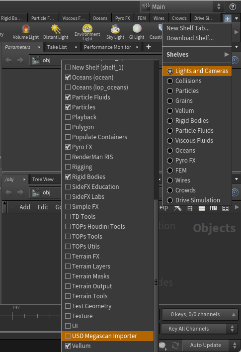

[Documentation Page Link](https://agastyapatel.github.io/USD_Megascan_Importer/)

> Consider giving ⭐ to the repository to support the project and creator. This would also help to create a notification for you whenever I create releases.\
> Reach out to me on linkedin: [AgastyaPatel](https://www.linkedin.com/in/4gastyaPatel/), email: contact2agastya@gmail.com 

> `Sorry for late update...I had a surgery due to accident last year and most of the time was occupied in my PT` 

# USD_Megascan_Importer
Plugin Tool for Houdini which converts the Megascan Assets into USD in Solaris and stores them in Layout Asset Gallery

## Tool Outline
- It unpacks different variants and converts the shading network to materialX network
- Can support different megasacan houdini packages - like it can supports single mesh, multiple variant in single subnet and splitted variants.
- Gives access to different file path prefixes and saves different file path presets so that it can be retrieved later
- All the assets are then displayed in the layout asset gallery so that User can directly drag and drop assets just like UE (Content browser)
- Also can render variants individually so that all objects are accessible in Gallery

Technologies Used : HOM API, Python, QT and few libraries.

## Installation Process
1. Download the release zip\
Unzip the folder `USD_Megascan_Importer` and save it at your houdini's preference folder `C:\Users\<username>\Documents\houdini20.0\scripts\` \

Outcome: `C:\Users\<username>\Documents\houdini20.0\scripts\USD_Megascan_Importer`

2. Copy the USD_Megascan_Importer.shelf from  `\USD_Megascan_Importer\bin\pref\USD_Megascan_Importer.shelf` to the toolbar folder in Houdini's preference folder ie,
`C:\Users\<username>\Documents\houdini20.0\toolbar\USD_Megascan_Importer.shelf`

3. Open Houdini. Go to add Shelf tab and you'll find the USD Megascan Convertor.\
</img>\
Shelf Appears with tools.
</img> 

4. Click `Load Tool` and you can use the convertor.

Enjoy!

## Screenshot
UI

Quick Demo

Additional Utilty tool: Shader convertor

